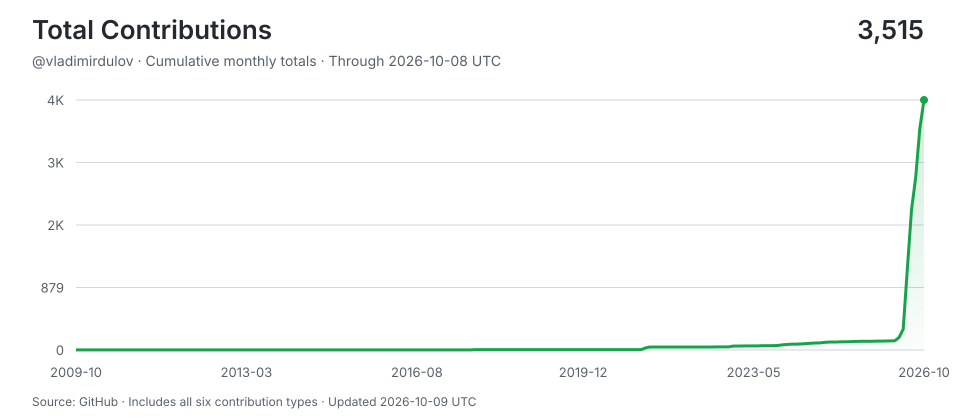

# vladimirdulov

> Shipping with AI agents around the clock -- human hours for thinking, machine hours for doing.
>
> Stats auto-updated by [aidevops](https://aidevops.sh).

<!-- STATS-START -->
## Work with AI

| Metric | Yesterday | Prior 7 Days | Prior 28 Days | Prior 365 Days |
| --- | ---: | ---: | ---: | ---: |
| Screen time (Linux) | 13.4h | 20.1h | 20.1h | ~3668h* |
| Interactive human attention | 0.0h | 0.0h | 0.0h | 0.0h |
| Interactive AI generation | 0.0h | 0.0h | 0.0h | 0.0h |
| Worker-classified human attention | 1.3h | 1.3h | 1.3h | 1.3h |
| Worker/headless AI generation | 6.1h | 6.1h | 6.1h | 6.1h |
| Additive observed work | 7.4h | 7.4h | 7.4h | 7.4h |
| Interactive sessions | 0 | 0 | 0 | 0 |
| Worker sessions | 49 | 49 | 49 | 49 |

_Screen time from linux-wtmp:login-session-proxy; collection status: ok. *365-day estimate uses observed calendar coverage._

_Periods are completed local calendar days ending at midnight; today is excluded._

_Human attention is unioned wall-clock time, so overlapping sessions are not double-counted. AI generation is additive machine work across sessions; it is not wall-clock concurrency._

## AI Model Usage (last 30 days)

| Model | Requests | Input | Output | Cache read | Cache write | Cache Hit-Rate % | Session Count | Session Hours |
| --- | ---: | ---: | ---: | ---: | ---: | ---: | ---: | ---: |
| gpt-6.1-sol | 1,179 | 4.1M | 192K | 96.0M | 0 | 95.8% | 49 | 6.8h |
| gpt-6-luna | 1 | 64K | 1K | 0 | 0 | 0.0% | 1 | 0.0h |
| **Total** | **1,180** | **4.2M** | **194K** | **96.0M** | **0** | **95.7%** | **49** | **6.8h** |

_100.4M total tokens processed. 95.7% cache hit rate._

## AI Model Usage (all time)

| Model | Requests | Input | Output | Cache read | Cache write | Cache Hit-Rate % | Session Count | Session Hours |
| --- | ---: | ---: | ---: | ---: | ---: | ---: | ---: | ---: |
| gpt-6.1-sol | 1,180 | 4.2M | 193K | 96.0M | 0 | 95.8% | 49 | 6.8h |
| gpt-6-luna | 1 | 64K | 1K | 0 | 0 | 0.0% | 1 | 0.0h |
| **Total** | **1,181** | **4.2M** | **194K** | **96.0M** | **0** | **95.7%** | **49** | **6.8h** |

_100.5M total tokens processed. 95.7% cache hit rate._
<!-- STATS-END -->

## Projects

- **[keetvibe](https://github.com/vladimirdulov/keetvibe)** -- keetvibe a webinar/live streaming platform
- **[domofon-control](https://github.com/vladimirdulov/domofon-control)** -- No description
- **[metrics](https://github.com/vladimirdulov/metrics)** -- No description
- **[eventslog-parser](https://github.com/vladimirdulov/eventslog-parser)** -- No description
<!-- CONTRIBUTIONS-START -->
## Contributions

- **[ArchiveBox](https://github.com/ArchiveBox/ArchiveBox)** -- 🗃 Open source self-hosted web archiving. Takes URLs/browser history/bookmarks/Pocket/Pinboard/etc., saves HTML, JS, PDFs, media, and more...
- **[dokuwiki-plugin-oauth](https://github.com/cosmocode/dokuwiki-plugin-oauth)** -- Generic oAuth1 and oAuth2 plugin for DokuWiki
- **[dolibarr](https://github.com/Dolibarr/dolibarr)** -- Dolibarr ERP CRM is a modern software package to manage your company or foundation's activity contacts, suppliers, invoices, orders, stocks, agenda, accounting, .... it's an open source Web application written in PHP designed for businesses of any sizes, foundations and freelancers.
- **[fast-atomic-flow](https://github.com/centaur-vova/fast-atomic-flow)** -- High-performance task visualizer built with PHP 8 & Swoole. Features real-time concurrency control using shared memory Swoole\Table, async channels, and coroutines for sub-millisecond task dispatching. No FPM, no overhead.
- **[go-pkgz-auth](https://github.com/go-pkgz/auth)** -- Authenticator via oauth2, direct, email and telegram 
- **[go-pkgz-notify](https://github.com/go-pkgz/notify)** -- Notifications via email, telegram and webhooks
- **[listmonk](https://github.com/knadh/listmonk)** -- High performance, self-hosted, newsletter and mailing list manager with a modern dashboard. Single binary app.
- **[matomo-plugin-LoginOIDC](https://github.com/dominik-th/matomo-plugin-LoginOIDC)** -- external authentication services for matomo
- **[paperless-ngx](https://github.com/paperless-ngx/paperless-ngx)** -- A community-supported supercharged version of paperless: scan, index and archive all your physical documents
- **[redmine_oauth-custom-oidc-provider](https://github.com/kontron/redmine_oauth)** -- Redmine authentication through OAuth.
- **[remark42](https://github.com/umputun/remark42)** -- comment engine
- **[roundcubemail](https://github.com/roundcube/roundcubemail)** -- The Roundcube Webmail suite
- **[study](https://github.com/fullstack-expert/study)** -- No description
<!-- CONTRIBUTIONS-END -->

## Connect

---

<!-- UPDATED-START -->
_Stats auto-updated 2026-10-08 02:53 UTC by [aidevops](https://aidevops.sh) pulse._
<!-- UPDATED-END -->

<!-- TOTAL-CONTRIBUTIONS-START -->

  <a href="https://commit-history.com/vladimirdulov?metric=total" target="_blank" rel="noopener noreferrer">
    <picture>
      <source media="(prefers-color-scheme: dark)" srcset="assets/contributions/total-dark.svg" />
      
    </picture>
  </a>

[Verify on commit-history.com](https://commit-history.com/vladimirdulov?metric=total) · [Chart data](assets/contributions/total.json)

Includes commits, issues, pull requests, reviews, repositories, and restricted contributions. Refreshed daily through the prior UTC day; commit-history.com may use a different refresh cutoff. GitHub controls link navigation—Ctrl/Cmd-click opens verification in a new tab.
<!-- TOTAL-CONTRIBUTIONS-END -->
